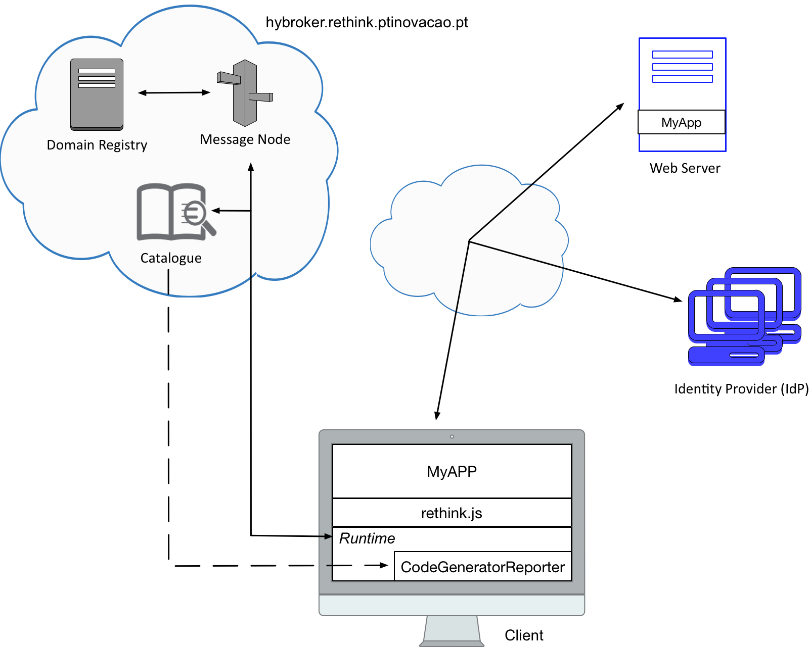

# 1st Load an Hyperty

Each team should develop a web application that uses the `Code Generator Reporter` hyperty that can be deployed from the `hybroker.rethink.ptinovacao.pt` catalogue. This hyperty generates a code according to the name of each team, which should be passed as input. The resulting code should be shown in the developed application.   



To overcome this first tutorial, each team should accomplish all the tasks bellow. 
Your feedback is extremely important for us, in order to improve the reTHINK framework in the future. As such, after completing all the tasks, each team should fill out this [Survey](https://docs.google.com/forms/d/e/1FAIpQLSezq9Zx9ZJJXuYi5orCslXkMX6eW9wKH5Db0f2TtJKyk393yw/viewform). 

## Task 1 (`estimate: 30 minutes`)

### Task 1.1:

`reTHINK distribution files` - To deploy the reTHINK runtime in your web application, it is necessary to execute `rethink.js`. 


<!-- There are two ways to obtain this script:

* Clone the `dev-runtime-browser` repository using the following command and copy the `bin` folder into the root of your application 

```shell
# Clone the runtime-browser repository:
$ git clone --branch=develop https://github.com/reTHINK-project/dev-runtime-browser.git
```
-->

* Add into your index.html the rethink file script

```html
<!DOCTYPE html>
<html>
  <head>
    <meta name="viewport" content="width=device-width, initial-scale=1.0">

    <script src="https://hybroker.rethink.ptinovacao.pt/.well-known/runtime/rethink.js"></script> 
  </head>
  <body>
  </body>
</html> 
```

### Task 1.2:

`Load Runtime` - the reTHINK runtime can be obtained after the execution of the `rethink.js` script by your application.

```javascript
rethink.default.install({ 
  domain: 'hybroker.rethink.ptinovacao.pt',
  development: true,
  runtimeURL: 'hyperty-catalogue://catalogue.hybroker.rethink.ptinovacao.pt/.well-known/runtime/Runtime'
  }).then((runtime) => {
    ... 
});
```


### Task 1.3:

`Load an Hyperty` - An Hyperty can be loaded using `requireHyperty()` method. For this challenge, the `Code Generator Reporter` hyperty, which is ready to be used in `hybroker.rethink.ptinovacao.pt` catalogue, should be loaded. To deploy it in a successful manner, authentication is mandatory.

```javascript
const hypertyURI = (hyperty_domain, hyperty) => 
`hyperty-catalogue://catalogue.${hyperty_domain}/.well-known/hyperty/${hyperty}`;

runtime.requireHyperty(hypertyURI('hybroker.rethink.ptinovacao.pt', 'CodeGeneratorReporter'))
.then((CodeGeneratorReporter) => {
  let codeGeneratorReporter = CodeGeneratorReporter.instance
});
```

## Task 2 (`estimate: 20 minutes`)

### Task 2.1:

`Data Object creation` - To sucessfully create the data object is necessary to pass the email (`Array`) associated to the `CodeGeneratorObserver` hyperty. This email should be inserted by the user into the web application, i.e using a text box and a button to validate the operation.

```javascript
codeGeneratorReporter.create(email).then((code) => {
  ...
});
```

### Task 2.2:

`Generate a code` - The generated code depends on the name of each team, which should be passed as input. This team name should be inserted by the user into the web application, i.e using a text box and a button to validate the operation.

```javascript
codeGeneratorReporter.generateCode(team_name).then((code) => {
  ...
});
```

#### Note: Don't forget to display the generated code on your developed application (HTML page).

## How to run

Open two chrome windows, one normal and another anonymous. The anonymous window should run the `CodeGeneratorObserver` hyperty. How to do this? Simply go to https://hybroker.rethink.ptinovacao.pt/ and select the `CodeGeneratorObserver` hyperty. Remember that with this hyperty, you should associate a different Google account from that used for the `CodeGeneratorReporter` hyperty.

[CodeGeneratorObserver example](https://github.com/BernardoMG/reTHINK-Beta-Tester-Event-v2.0/blob/master/Figures/CodeGeneratorObserver.png)

#### Note: Run `CodeGeneratorObserver` hyperty first.

##

### [Survey!!!](https://docs.google.com/forms/d/e/1FAIpQLSezq9Zx9ZJJXuYi5orCslXkMX6eW9wKH5Db0f2TtJKyk393yw/viewform) 
