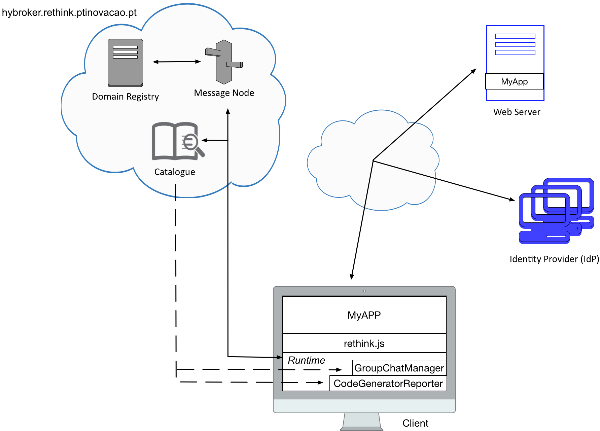

# 2nd Combining multiple Hyperties in a web application 

Each team should develop a chat application that uses the `Code Generator Reporter` and `Group Chat Manager` hyperties that can be deployed from the `hybroker.rethink.ptinovacao.pt` catalogue. The `Code Generator Reporter` hyperty generates a code according to the name of your team that should be passed an input. The `Group Chat Manager` hyperty's main functionality is to handle text conversations among groups, including:

 * Creation of a new Group Chat, with the possibility of inviting users to join it
 
 * Send message to group

 * Receive message from group, together with the identity of the sender
 

With this application, users can create chat rooms to exchange messages with each other. Each chat room must be identified by a certain name. The idea is that users can invite others to a chat room by indicating their email address. In addition, users can also join some chat room using its identifier. Once inside a chat room, users can exchange messages between them. 
   



To overcome this second tutorial, each team should accomplish all the tasks bellow. 
Your feedback is extremely important for us in order to improve reTHINK framework in the future. As such, after completing all the tasks, each team should fill out this [Survey](https://docs.google.com/forms/d/e/1FAIpQLSdSUG4lieayZa_SaV64shdn5VG8NgmfxlzcLWVTlQAzresccw/viewform). 


## Task 1 (`estimate: 10 minutes`)

To accomplish this first task, each team can continue working on the developed application of the first challenge. The only difference is that now the application must use `Code Generator Reporter` and `Group Chat Manager` hyperties. So, it is necessary to deploy the `Group Chat Manager` hyperty into the application. This second hyperty is also present in the `hybroker.rethink.ptinovacao.pt` catalogue.


## Task 2 (`estimate: 2 hours and 30 minutes`)

### Task 2.1:

`Creation of chat rooms` - Chat rooms must be identified by a certain name (`String`). When a chat room is created, the user can also provide a list of emails (`Array`) to invite to the chat room. Alternatively, if some user is in a different domain, this must be provided in order to receive the invitation (`Array`). 

```javascript
GroupChatManager.create(name, emails, domains).then((chatController) => {
  ...
});
```


### Task 2.2: 

`Join chat room` - As soon as the chat room is created, an URL is generated (`DataObject Reporter URL`), that other users should use if they want to join the chat room.

```javascript
GroupChatManager.join(url).then((chatController) => {
  ...
});
```


### Task 2.3: 

`Exchange of messages` - Inside the chat room, users can easily exchange messages between them.

```javascript
chatController.send(message).then((result) => {
  ...
});
```

## Task 3 (`estimation: 10 minutes`)

`Generate a code and broadcast to all the participants` - The generated code depends on the name of each team that should be passed as input. When the code is received, it should be sent to all the participants of the chat room.

## How to run

Open two chrome windows, one normal and another anonymous. Load the application in both windows, but using different accounts, i.e. email addresses.

##

### [Survey!!!](https://docs.google.com/forms/d/e/1FAIpQLSdSUG4lieayZa_SaV64shdn5VG8NgmfxlzcLWVTlQAzresccw/viewform) 

