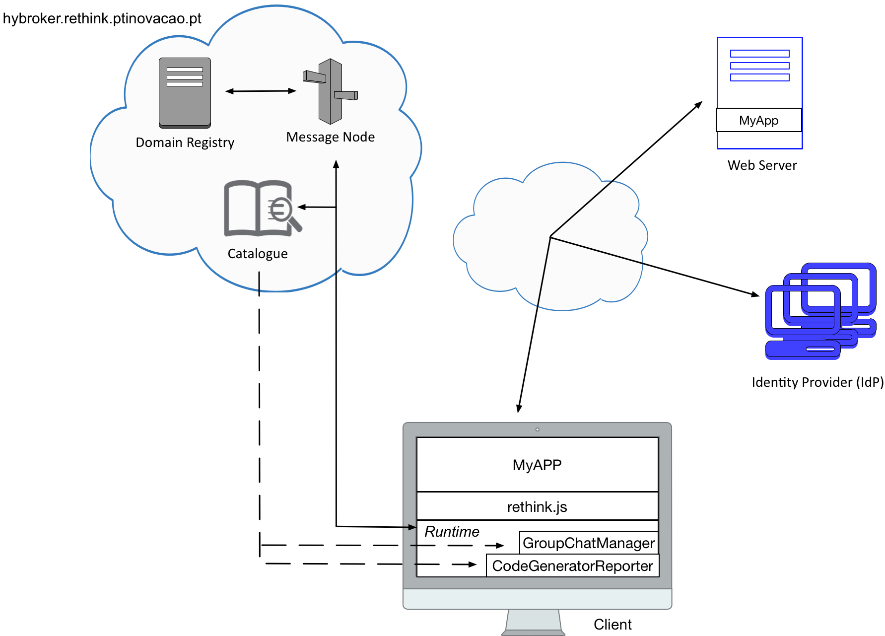

# 3rd Hyperty development 

Each team should continue working on the previously developed application that uses the `Code Generator Reporter` and `Group Chat Manager` hyperties. The goal of this third tutorial is to change the `Code Generator Reporter` hyperty. Now, whenever a code is generated, it should also generate a timestamp that will be returned with the generated code to the application.   





To overcome this third tutorial, each team should accomplish all the tasks bellow. 
Your feedback is extremely important for us in order to improve reTHINK framework in the future. As such, after complete all the tasks, each team must fill out this [Survey](https://docs.google.com/forms/d/e/1FAIpQLSfrlXAJu6wWiazL0tFQNjXr3ig5uLd4s9N5D_3WMivxNdBCMA/viewform). 


## Task 1 (`estimate: 15 minutes`)

`Hyperty Development Toolkit` - Currently, the toolkit can be used to develop hyperties to be executed in the Browser or in NodeJS. It is essential to use the toolkit in order to change the `Code Generator Reporter` hyperty and complete this challenge. In order to configurate properly the Toolkit follow the available documentation [here](https://github.com/reTHINK-project/dev-hyperty-toolkit/blob/develop/README.md).

#### Note: Use `develop` branch of dev-hyperty-toolkit and dev-hyperty repositories.
<!-- 
### Task 1.1: 

`NVM, Node and NPM Installation`

```shell
# NVM Installation
$ curl -o- https://raw.githubusercontent.com/creationix/nvm/v0.33.1/install.sh | bash
# Restart your terminal so NVM can be used

# Node Installation
$ nvm install 6.6.0

# To verify that node and npm was correctly install run:
$ node -v
$ npm -v
```


### Task 1.2: 

`reTHINK environment configuration` 

```shell
# clone the toolkit repository:
$ git clone --branch=develop https://github.com/reTHINK-project/dev-hyperty-toolkit.git

# clone the dev-hyperty repository:
$ git clone --branch=develop https://github.com/reTHINK-project/dev-hyperty.git

# Note: Ensure that both repositories are cloned inside the same directory 
```

```shell
# Inside the toolkit repository run:
$ npm install -g karma-cli gulp-cli browserify
$ npm install

# Note: It may take a while to install all modules. Hang tight. 
```

```shell
# run the toolkit for browser
$ npm run start:browser

# Note: If you are using MAC OS you may need to run the above command with sudo privileges; 
#       Otherwise with Linux, you can solve this problem with the following command. 
#       As result, you do not need sudo privileges.

$ sudo setcap 'cap_net_bind_service=+ep' `which node`

```


Open https://catalogue.localhost/ and accept certificate

Open https://localhost/ and select an Hyperty to run.
-->

## Task 2 (`estimation: 30 minutes`)

### Task 2.1:

`Change Code Generator Reporter hyperty` - Inside the `dev-hyperty` folder is the source code of each hyperty (`src` folder). The toolkit encodes everything in this folder. Each team should change the `generateCode(name)` method present in the `CodeGeneratorReporter.hy.js` file. This method should generate a code, that will depend on the input, and a timestamp. Both should be returned.

#### Note: The `code` and the `timestamp` must be in the code field in the data of your CodeGenerator. 

<!--
### Task 2.2:

`Restart toolkit` - Run again the `npm run start:browser` command to restart the toolkit and check if everything is correctly encoded. It should not return any error in the terminal.
-->

### Task 2.2:

`Generate a code and broadcast to all the participants` - Restart your app and try to generate a new code and broadcast it to all the participants of some chat room.

#### Note: Don't forget that the hyperty domain changed. For this challenge, you want to obtain the hyperty locally from the toolkit, not from the `hybroker.rethink.ptinovacao.pt` catalogue.

### [Survey!!!](https://docs.google.com/forms/d/e/1FAIpQLSfrlXAJu6wWiazL0tFQNjXr3ig5uLd4s9N5D_3WMivxNdBCMA/viewform) 
