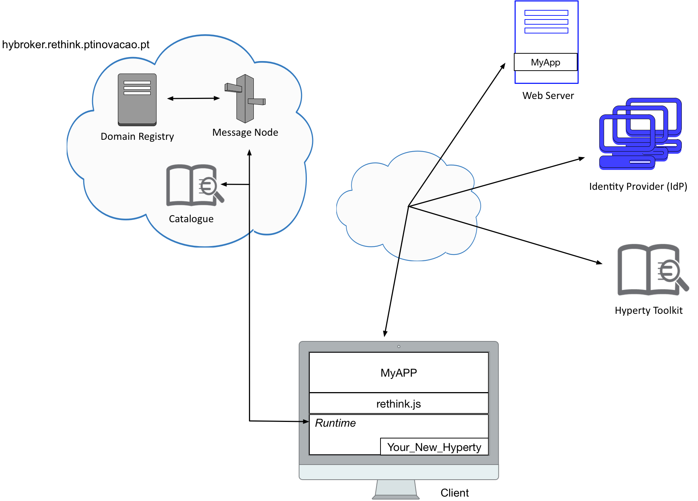

# Challenge

Each team must develop a web application that takes advantage of one or more hyperties. The features of this new web application are up to each team. Each team is free to design the hyperty or hyperties, as well as the web application that uses it. We will value teams who try to develop innovative hyperties and applications, in terms of functionalities. Read carefully the documentation available at the root of this repository. It will be very useful in order to complete this challenge.

Your feedback is extremely important for us in order to improve the reTHINK framework in the future. As such, after complete all the tasks, each team must fill out this [Survey](https://docs.google.com/forms/d/e/1FAIpQLScTQeolosHiaBMDT-uDx4eppZA_QLbiOET8U3j2vucHf-aSgg/viewform). 

### Note: If you do not fill out this form, your participation will not be considered! 

##

### [Survey!!!](https://docs.google.com/forms/d/e/1FAIpQLScTQeolosHiaBMDT-uDx4eppZA_QLbiOET8U3j2vucHf-aSgg/viewform) 
